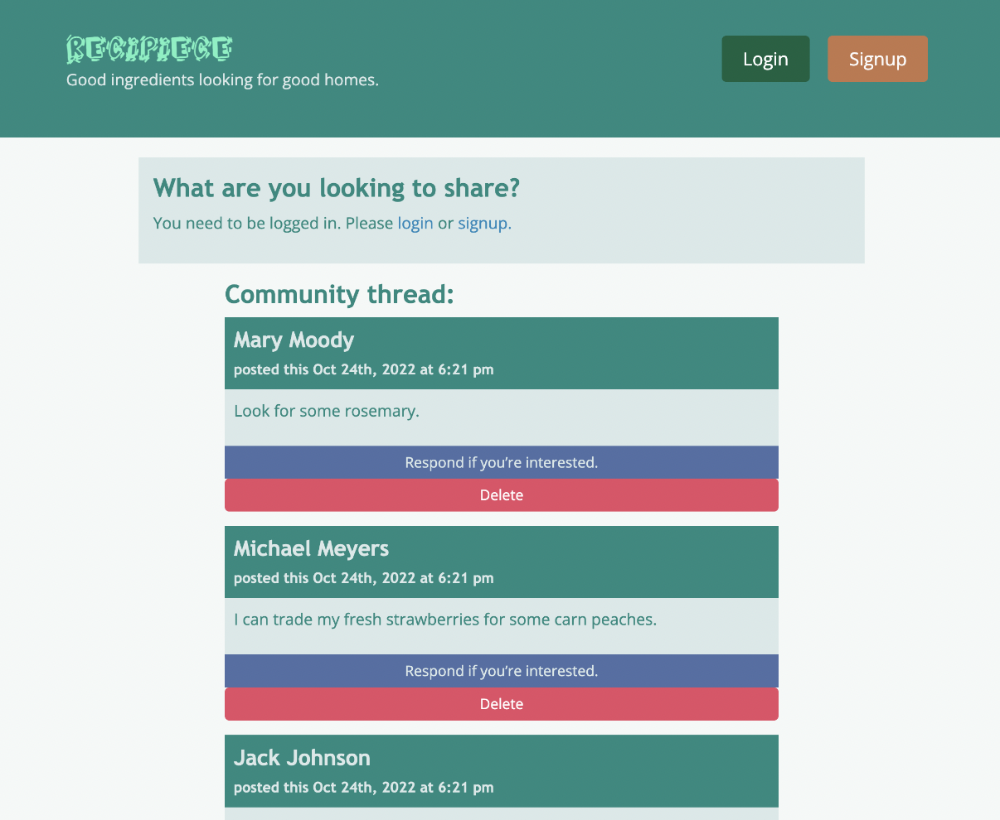

# ReciPiece

## Description

Have you ever had excess food in your home that you wish you could trade or give away before it goes to waste? ReciPiece is a MERN stack single-page application that allows you to do just that. You will be able to create posts as well as interact with other users on your journey to eliminate food waste.

## Usage

The following image shows the application's appearance and functionality:

   

## Features

* React for the front end
* GraphQL with a Node.js and Express.js server
* MongoDB and the Mongoose ODM for the database
* CSS styling
* JWT authentication
* Sensitive API key information protection
* Deployed using Heroku

## Future Enhancements

* Ability to edit and delete comments
* Availability in all cities
* Timestamp to show when a post/comment has been edited 
* Ability to upload pictures of what’s being shared
* Location features to extend it beyond Columbus
* Ability to trade more than just food

## Credits

Annie Hoang (anniehoang.anh@gmail.com)

Eric Shek (ericshek23@yahoo.com

Vincent Dejulius (dejuliusvince@gmail.com)

